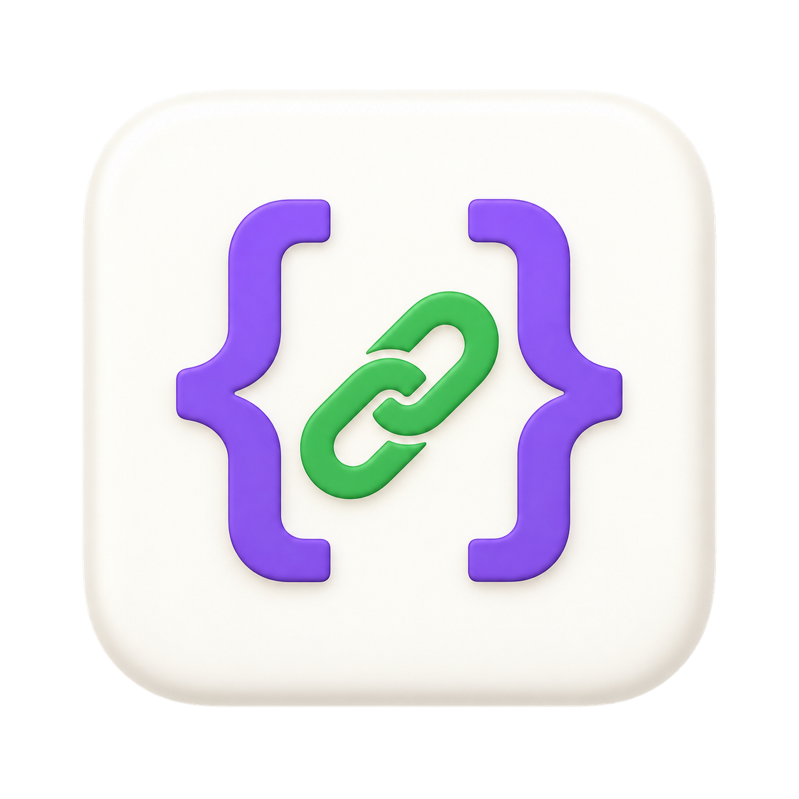

# URL Parser



[English](README.en.md) | 简体中文

用于开发调试的 macOS 原生 URL 参数编辑器。左侧编辑 URL，右侧编辑解码后的 Query JSON，两侧实时同步。使用 Swift + AppKit，无第三方依赖、无 WebView，全部处理在本地完成，不发送网络请求。

## 功能

- **双向编辑**：粘贴 URL 即可查看格式化 JSON；修改 JSON 后自动更新 URL。JSON 未写完或格式无效时，显示错误并保留上一条有效 URL。
- **快速操作键值**：单击 key 选中键名，同时高亮对应 key/value。右键复制或删除 key/value；删除 key 移除整个参数，删除 value 清空为字符串。
- **原生编辑快捷键**：支持复制、粘贴、剪切、全选、撤销和重做。撤销与重做会同步恢复两侧内容。
- **分栏与配色**：默认左右各占 50%，记住拖动后的分栏比例；JSON 使用 IDEA Light 配色。
- **离线二维码**：点击按钮生成当前 URL 的二维码，超出单个二维码容量时显示提示。
- **保留参数语义**：支持自定义协议、重复参数、空值和无等号参数；未修改参数保留原始编码及顺序。

参数值保持字符串，避免长整数、前导零或布尔文本被自动转换。重复参数使用数组，无等号参数使用 `null`：

```json
{
  "city": "北京",
  "id": "00123",
  "tag": ["a", "b"],
  "empty": "",
  "flag": null
}
```

`tag` 对应 `tag=a&tag=b`，`empty` 对应 `empty=`，`flag` 对应无等号的 `flag`。百分号编码只解码一层，`+` 保留为加号；嵌套 JSON 保持字符串形式。URL 内容只在本次运行中保留，退出前请复制需要保存的数据。

## 性能

- v1.0.0 通用安装包约 **1.46 MiB**，包含 Apple Silicon 和 Intel 两种架构及应用图标。
- 本机调试构建中，**1000 个参数的解析和 JSON 格式化约 3 毫秒**，不含文本绘制。
- 使用原生文本组件和差量撤销记录；撤销历史最多保留 100 组操作。二维码按需生成，关闭后释放相关资源。

以下是内存优化阶段的测量：Apple Silicon Mac、macOS 26.5.2、Release 构建，两轮独立进程，每阶段等待 2 秒采样。

| 场景 | 优化前 | 优化后 |
| --- | ---: | ---: |
| 空白启动 | 25.1–25.7 MiB | 31.4–31.7 MiB |
| 1000 个参数 | 148.3–156.3 MiB | 41.4–42.5 MiB |
| 再连续编辑 100 次 | 167.8–169.8 MiB | 46.0–47.0 MiB |
| 改为短链接并打开二维码 | 53.1–53.7 MiB | 50.7–50.8 MiB |

数据为 `TASK_VM_INFO.phys_footprint`，不是 RSS，也不是内存上限。长文档场景物理内存减少约 73%，空白启动没有降低；实际用量随输入、窗口尺寸和系统缓存变化。这些是优化阶段的测量，并非最终发行包的完整基准。

[优化前原始记录](docs/memory-before.txt) · [优化后原始记录](docs/memory-after.txt)。可运行 `./scripts/measure-memory.sh` 复测。

当前源码开发版还支持直接编辑协议、Host 和路径（空白状态也可创建 URL），并更新了扁平工具栏和局部文本／配色刷新。通用应用约 0.74 MiB；编辑耗时及测量限制见[本次优化记录](docs/optimization-2026-09-20.md)。这些更新尚未包含在 v1.0.0 下载包中，可从源码构建。

## 安装

1. 从 [GitHub Releases](https://github.com/langweicheng/urlparse/releases/latest) 下载 `URL-Parser-1.0.0-macOS-universal.zip`。
2. 解压，将 `URL Parser.app` 拖入「应用程序」文件夹。
3. 从「应用程序」中打开 URL Parser。

需要 **macOS 13 或以上**。Apple Silicon 与 Intel 使用同一个安装包；Intel 版本已编译，尚未在 Intel 实机验证。

当前版本采用 ad-hoc 本地签名，未做 Apple Developer ID 签名或公证。首次打开若被系统拦截，可在确认来源后到「系统设置 → 隐私与安全性」选择「仍要打开」。Release 页面提供 SHA-256 校验值，可用 `shasum -a 256 <下载的 ZIP 路径>` 核对。

### 从源码构建

安装 Xcode 或包含 Swift 的命令行工具，在项目根目录执行：

```sh
./scripts/build-app.sh
open 'dist/URL Parser.app'
```

默认构建当前 Mac 的架构。`./scripts/package-release.sh` 生成通用应用、ZIP 和校验文件；`swift test` 运行测试。也可以用 Xcode 打开 `Package.swift`。
